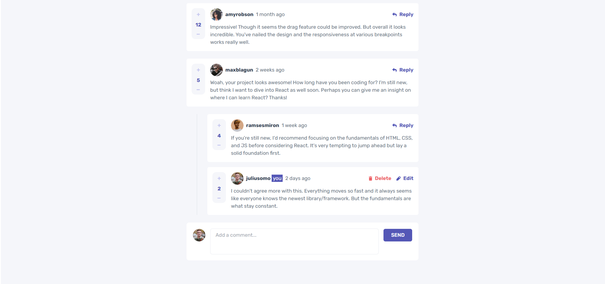

# Interactive Comments Section (Full Stack)

Aplicação full stack baseada no desafio da Frontend Mentor, [Interactive comments section](https://www.frontendmentor.io/challenges/interactive-comments-section-iG1RugEG9), com CRUD de comentários e respostas, votação e persistência em MongoDB.

## Sumário

- [PT-BR](#pt-br)
	- [Funcionalidades](#funcionalidades)
	- [Stack](#stack)
	- [Estrutura](#estrutura)
	- [Como rodar localmente](#como-rodar-localmente)
	- [Build para produção local](#build-para-produção-local)
	- [Reseed do banco](#reseed-do-banco)
	- [Endpoints principais](#endpoints-principais)
	- [Autor](#autor)
- [English](#english)
	- [Features](#features)
	- [Stack (EN)](#stack-en)
	- [Project Structure](#project-structure)
	- [How to run locally](#how-to-run-locally)
	- [Build for local production](#build-for-local-production)
	- [Database reseed](#database-reseed)
	- [Main endpoints](#main-endpoints)
	- [Author (EN)](#author-en)

## PT-BR

## Funcionalidades

- Buscar comentários e respectivas respostas 
- Criar e responder comentários
- Editar comentário/resposta
- Excluir comentário/resposta com confirmação
- Upvote e downvote
- Exibir data em formato relativo (time ago), com base em timestamp salvo no banco

## Stack

### Frontend

- React + Vite
- SWR (fetch)
- date-fns (formatação de tempo relativo)

### Backend

- Node.js + Express
- MongoDB + Mongoose

## Estrutura

- front: aplicação React
- back: API e servidor estático

## Como rodar localmente

### Pré-requisitos

- Node.js 18+
- MongoDB local ou remoto

### 1 - Backend

Crie o arquivo back/.env com:

MONGODB_URI=mongodb://localhost:27017/seu-banco
PORT=3001

Instale e execute:

cd back
npm install
npm run dev

### 2 - Frontend

Em outro terminal:

cd front
npm install
npm run dev

## Build para produção local

O backend serve os arquivos estáticos de front/dist.

Para atualizar a versão servida pelo backend:

cd front
npm run build

Depois, acesse via backend (porta 3001).

## Reseed do banco

Foi adicionado um script para resetar e popular comentários com base no data.json, convertendo os createdAt do dataset para timestamps reais.

Com o backend rodando:

cd back
npm run reseed

Script: back/scripts/reseed-comments.mjs

## Endpoints principais

- GET /api/comments
- POST /api/comments
- PATCH /api/comments/:id
- DELETE /api/comments/:id
- POST /api/comments/:id/replies
- GET /api/users/:id

## Autor

[Silas](https://www.linkedin.com/in/silascosta310)

---

## English

Full-stack application based on the Frontend Mentor challenge, [Interactive comments section](https://www.frontendmentor.io/challenges/interactive-comments-section-iG1RugEG9), featuring comment/reply CRUD, voting, and MongoDB persistence.

## Features

- Fetch comments and related replies
- Create comments and replies
- Edit comments/replies
- Delete comments/replies with confirmation
- Upvote and downvote
- Display date in relative format (time ago), based on timestamps stored in the database

## Stack (EN)

### Frontend

- React + Vite
- SWR (fetch)
- date-fns (relative time formatting)

### Backend

- Node.js + Express
- MongoDB + Mongoose

## Project Structure

- front: React application
- back: API and static server

## How to run locally

### Requirements

- Node.js 18+
- Local or remote MongoDB

### 1 - Backend

Create the back/.env file with:

MONGODB_URI=mongodb://localhost:27017/your-database
PORT=3001

Install and run:

cd back
npm install
npm run dev

### 2 - Frontend

In another terminal:

cd front
npm install
npm run dev

## Build for local production

The backend serves static files from front/dist.

To update the version served by the backend:

cd front
npm run build

Then access the app through the backend (port 3001).

## Database reseed

A script was added to reset and repopulate comments from data.json, converting dataset createdAt values into real timestamps.

With the backend running:

cd back
npm run reseed

Script: back/scripts/reseed-comments.mjs

## Main endpoints

- GET /api/comments
- POST /api/comments
- PATCH /api/comments/:id
- DELETE /api/comments/:id
- POST /api/comments/:id/replies
- GET /api/users/:id

## Author (EN)

[Silas](https://www.linkedin.com/in/silascosta310)
